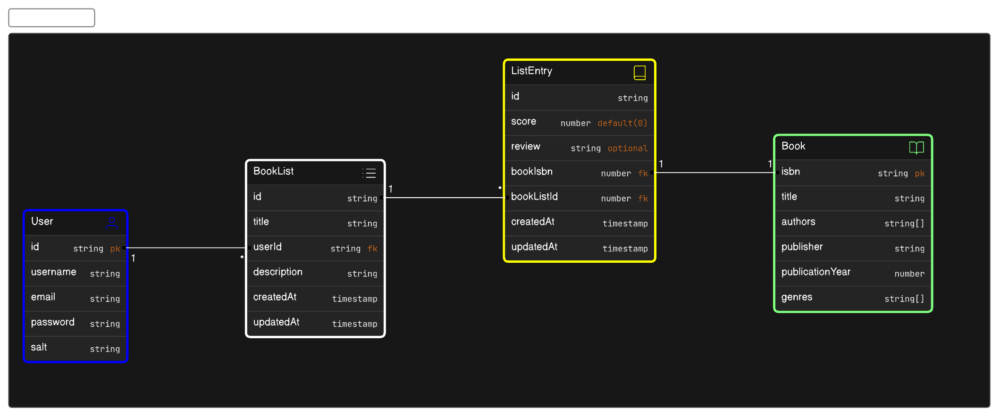

## Bookkeeper

Bookkeeper is a backend project for a book list application that supports basic user, book, book list and list entry CRUD operations.

### Data model

The project web based on the following data model



the data model image can be found inside the ```imgs``` folder.

### Technologies

<p align="center"> 
    <a href="https://www.typescriptlang.org/" target="_blank"></a>
    <a href="https://nodejs.org/en" target="_blank"></a>
    <a href="https://www.prisma.io/" target="_blank"></a>
    <a href="https://www.postgresql.org/" target="_blank"></a>
</p>